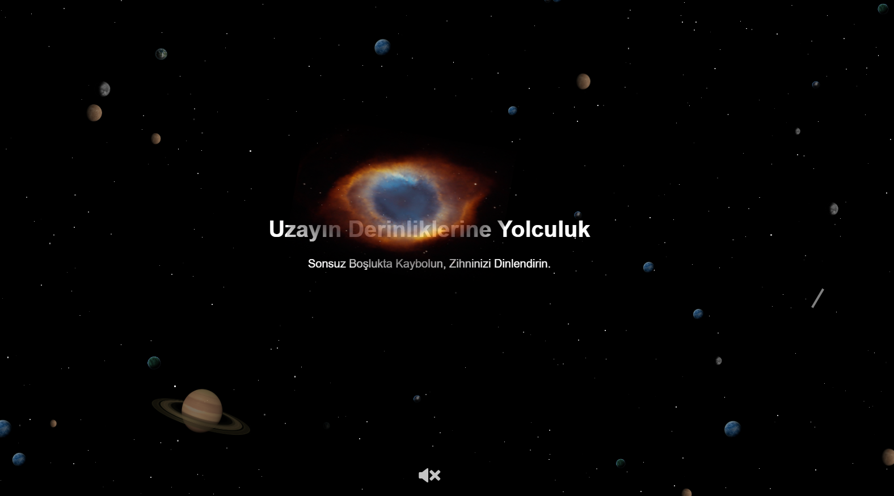

# Uzay Temalı Web Sitesi
Bu proje, HTML, CSS ve JavaScript kullanarak interaktif bir uzay temalı web sitesi oluşturmayı amaçlıyor. Sitede; sonsuz uzay boşluğunda hareket eden gezegenler, yıldızlar, kayan yıldızlar ve görkemli Samanyolu galaksisi yer alıyor. Kullanıcılar, etkileşimli öğelerle uzayın büyüleyici atmosferini deneyimleyebilirler.

**Canlı Demo:**

[Canlı Demo Link] (https://uzay.vercel.app/)

**Özellikler:**

**Dinamik Yıldız Alanı:** Yanıp sönen yıldızlar, sonsuz uzay boşluğunu simüle ederek görsel bir şölen sunar.

**Hareketli Gezegenler:** Farklı boyutlarda ve görsellerde gezegenler, rastgele yönlerde hareket ederek uzayın dinamik yapısını yansıtır.

**Kayan Yıldızlar:** Gerçekçi bir şekilde hareket eden kayan yıldızlar, gece gökyüzüne benzersiz bir atmosfer katar.

**Samanyolu Galaksisi:** Yavaşça hareket eden ve dönen Samanyolu galaksisi, uzayın büyüklüğünü ve ihtişamını vurgular.

**Gezegen Yutma Animasyonu:** Samanyolu'na yaklaşan gezegenler, etkileyici bir animasyonla galaksi tarafından yutulur.

**Gezegen Patlama Efekti:** Kullanıcılar, gezegenlere tıklayarak patlama efektini tetikleyebilir ve ses efektleriyle zenginleştirilmiş bir görsel deneyim yaşayabilirler.

**Müzik ve Ses Kontrolü:** Kullanıcılar, arka plan müziğini kontrol edebilir ve ses seviyesini ayarlayabilir.

**Gezegen Spawn Olması:** Gezegen sayısı belirli bir sınırı geçmemek koşuluyla düzeli olarak spawn olur.

**Teknolojiler**

**HTML:** Web sitesinin temel yapısını oluşturmak için kullanılır.

**CSS:** Siteye stil ve görsel efektler eklemek için kullanılır.

**JavaScript:** Siteye interaktiflik ve animasyonlar eklemek için kullanılır.

**Nasıl Kullanılır**
-Projeyi klonlayın veya indirin.

-index.html dosyasını bir web tarayıcısında açın.

-Uzayın büyüleyici atmosferinin keyfini çıkarın!

**Ekran Görüntüsü**

